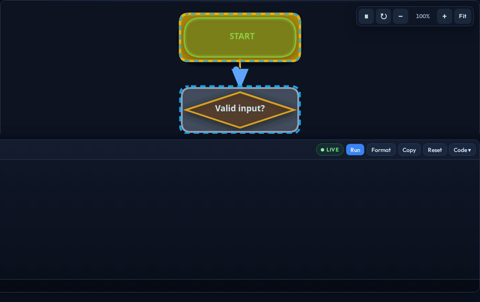
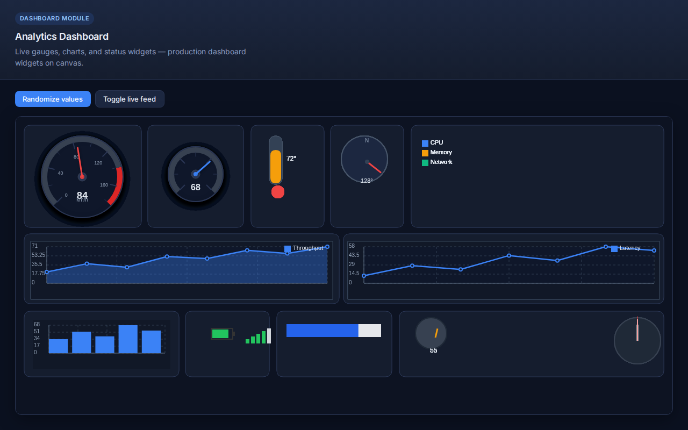
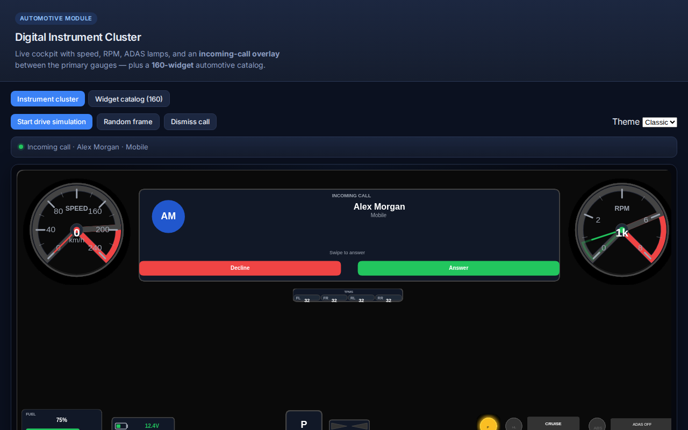
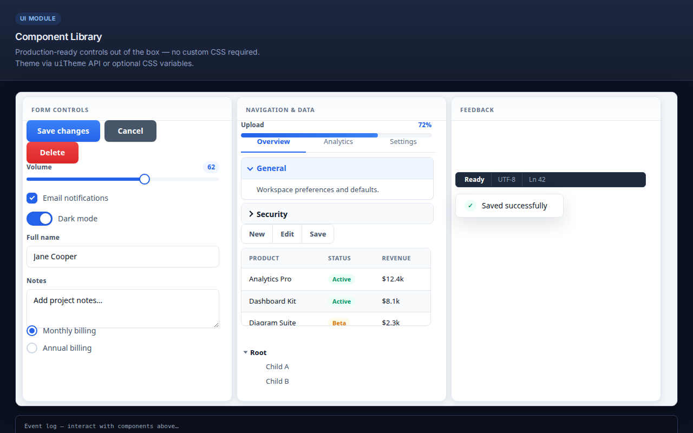
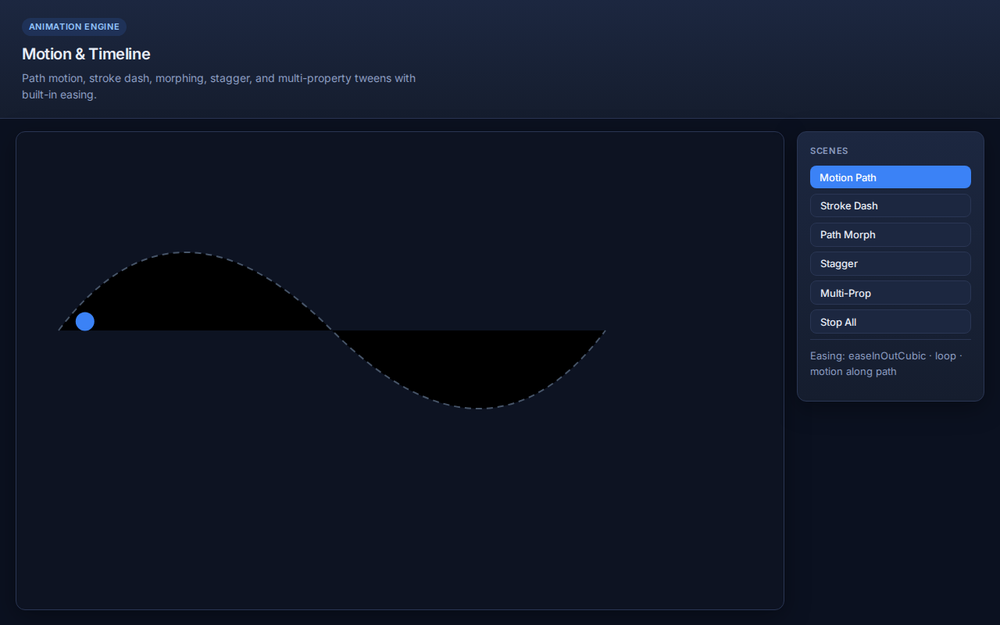

<p align="center">
  
</p>

<h1 align="center">LightDraw.js</h1>

<p align="center">
  <strong>One library for dashboards, automotive HMIs, diagrams, and UI — zero dependencies.</strong><br/>
  Canvas · SVG · HTML renderers · JSON-first for AI · ES5 for embedded WebViews.
</p>

<p align="center">
  <a href="https://www.npmjs.com/package/lightdraw"></a>
  
  
  
</p>

<p align="center">
  <a href="https://github.com/rakeshrajena/lightDraw">GitHub</a>
  ·
  <a href="https://rakeshrajena.github.io/lightDraw/">Live playground</a>
  ·
  <a href="https://rakeshrajena.github.io/lightDraw/#diagram">Diagram demo</a>
  ·
  <a href="https://www.npmjs.com/package/lightdraw">npm</a>
  ·
  <a href="https://github.com/rakeshrajena/lightDraw/blob/main/docs/v1.2-release-notes.md">v1.2 notes</a>
</p>

---

## See it in action

<p align="center">
  
</p>
<p align="center"><em>Diagram wire flow — dashes + packets, idle→active→done status tint, built-in ▶⏸↻ + zoom</em></p>

<p align="center">
  
</p>
<p align="center"><em>Dashboard — multi-series charts, gauges, dataTable</em></p>

<p align="center">
  
</p>
<p align="center"><em>Automotive — cluster, Individual dash, MIL / beams / ADAS lamps</em></p>

<p align="center">
  
</p>
<p align="center"><em>UI — 17 components, theme presets, HTML renderer</em></p>

<p align="center">
  
</p>
<p align="center"><em>Animation — timelines, motion paths, stagger, morph</em></p>

---

## The problem LightDraw solves

Building **interactive 2D graphics** in the browser usually means stacking tools:

| Typical stack | Pain |
|---------------|------|
| React + Chart.js + D3 + diagram lib | Large bundle, framework lock-in, many APIs to learn |
| Raw Canvas API | No scene graph, manual hit-testing, no animation timeline |
| Low-code / AI UI generators | Output is React/HTML code — hard to embed in WebView or validate |
| Automotive HMI tools | Expensive, closed, or not web-native |

**LightDraw** replaces that stack with **one zero-dependency engine**:

- **Retained-mode scene graph** — add/move/animate nodes; renderer draws efficiently
- **Three renderers** — pick Canvas (performance), SVG (vectors), or HTML (accessibility + legacy WebView)
- **JSON scenes** — validate, load, export; ideal for **AI agents** and config-driven UIs
- **Domain modules** — dashboard widgets, automotive cluster, diagrams, UI components — same API
- **ES5 legacy build** — ship to Chromium 49+ infotainment without a transpiler at runtime

---

## What you get (benefits)

| Benefit | What it means for you |
|---------|------------------------|
| **Zero runtime deps** | No `npm install react chart.js d3`. Smaller attack surface, simpler audits. |
| **Pay for what you load** | `lightdraw/core` ~43 KB gzip; add `dashboard`, `automotive`, or `diagram` plugins only if needed. |
| **Ship faster** | `loadJSON(scene)` for whole dashboards; `app.setUiTheme({ preset: 'dark' })` — no custom CSS required. |
| **AI-ready** | Schema docs + `validateSceneJSON` / `parseAndValidateSceneJSON` with path + expected-value hints — LLM output becomes a live UI in one call. |
| **Embed anywhere** | CDN script tag, npm ESM, or ES5 UMD in Android WebView / Qt WebEngine. |
| **Export & audit** | PNG, SVG, PDF, JSON, offline HTML from the same scene. |
| **Production tested** | 1 600+ tests, size gates, benchmark regression, visual smoke on demos. |

---

## When to use LightDraw (and when not to)

| ✅ Use LightDraw when… | ❌ Consider something else when… |
|------------------------|----------------------------------|
| Embedded dashboard or HMI in WebView | You need a full SPA framework (routing, SSR) — use React/Vue *with* LightDraw in a panel, or alone |
| AI/low-code generates **JSON** UIs | You only need static marketing pages |
| Automotive cluster, gauges, CAN-style visuals | 3D / WebGL games (use Three.js / Babylon) |
| Flowcharts, network topology, org charts | Heavy document editing (Google Docs–class) |
| Canvas performance + interaction (drag, zoom) | You already have D3-only data-viz and don't need widgets/HMI |
| Legacy ES5 targets without bundlers | You need native mobile UI (use Swift/Kotlin) |

---

## Quick start

```bash
npm install lightdraw
```

```html
<link rel="stylesheet" href="https://cdn.jsdelivr.net/npm/lightdraw@1/dist/lightdraw.min.css">
<div id="app" style="position:relative;width:100%;height:480px"></div>
<script src="https://cdn.jsdelivr.net/npm/lightdraw@1/dist/lightdraw.min.js"></script>
<script>
  const app = LightDraw.createApp('#app', {
    width: 800,
    height: 480,
    background: '#0f172a',
    renderer: 'canvas',
  });
</script>
```

```javascript
import LightDraw from 'lightdraw';
const app = LightDraw.createApp('#app', { renderer: 'canvas' });
```

| Import path | Use case |
|-------------|----------|
| `lightdraw` | Everything in one bundle (~169 KB gzip) |
| `lightdraw/core` | Shapes + canvas only (~43 KB gzip) |
| `lightdraw/dashboard` | Charts, gauges, multi-series, dataTable |
| `lightdraw/automotive` | Cluster, telltales, Individual dash |
| `lightdraw/diagram` | Flowchart, network, CAN, editor, wire flow + toolbar |
| `lightdraw/legacy` | ES5 UMD for WebView |

---

## Diagram examples (JSON → LightDraw)

Define a **scene object**, then load it. Same pattern for every diagram type.

```javascript
const app = LightDraw.createApp('#app', {
  width: 800,
  height: 480,
  background: '#0f172a',
  renderer: 'canvas',
});

function mountDiagram(scene) {
  app.clear();
  const chart = LightDraw.Diagram.fromJSON(scene.type, scene.props, app);
  app.add(chart);
  LightDraw.Diagram.fitToBounds(chart, 800, 480, 24);
  LightDraw.Diagram.installEditor(app, chart, {
    mode: 'arrange',
    allowResize: true,
    allowRotate: true,
  });
  return chart;
}

// Or: app.loadJSON(scene) when the root type is a registered diagram / group
```

| `type` | Notes |
|--------|--------|
| `flowchart` | Decisions, process, terminals + wire flow |
| `stateMachine` | States + transitions |
| `processPipeline` | Stages with status badges |
| `networkTopology` | Visio/Cisco-style icons |
| `canNetwork` | ECU bus + optional frame paths |
| `electricalSchematic` | IEC symbols + wires |
| `classDiagram` | UML classes + relations |
| `mindMap` | Center + branches |
| `orgChart` | Hierarchy cards (collapse in editor) |

### Flowchart + wire flow

```javascript
const flowchartScene = {
  type: 'flowchart',
  props: {
    width: 800,
    height: 480,
    data: {
      nodes: [
        { id: 'start', label: 'Start', type: 'start', x: 360, y: 24 },
        { id: 'check', label: 'Valid input?', type: 'decision', x: 360, y: 110 },
        { id: 'process', label: 'Process data', type: 'process', x: 360, y: 210 },
        { id: 'end', label: 'Complete', type: 'end', x: 360, y: 300 },
      ],
      edges: [
        { from: 'start', to: 'check' },
        { from: 'check', to: 'process', label: 'Yes' },
        { from: 'check', to: 'end', label: 'No' },
        { from: 'process', to: 'end' },
      ],
    },
    flow: {
      enabled: true,
      mode: 'both',
      playback: 'loop',
      statusHighlight: true,
      paths: [
        ['start', 'check', 'process', 'end'],
        ['start', 'check', 'end'],
      ],
      // chrome: true by default → ▶⏸↻ + zoom
    },
  },
};
mountDiagram(flowchartScene);
```

### State machine

```javascript
const stateMachineScene = {
  type: 'stateMachine',
  props: {
    width: 800,
    height: 400,
    data: {
      states: [
        { id: 'idle', label: 'Idle', x: 80, y: 120 },
        { id: 'run', label: 'Running', x: 320, y: 120 },
        { id: 'done', label: 'Done', x: 560, y: 120, kind: 'final' },
      ],
      transitions: [
        { from: 'idle', to: 'run', label: 'start' },
        { from: 'run', to: 'done', label: 'finish' },
      ],
    },
    flow: {
      enabled: true,
      mode: 'both',
      paths: [['idle', 'run', 'done']],
    },
  },
};
mountDiagram(stateMachineScene);
```

### Pipeline

```javascript
const pipelineScene = {
  type: 'processPipeline',
  props: {
    width: 800,
    height: 280,
    stages: [
      { id: 'ingest', label: 'Ingest', status: 'done', type: 'input' },
      { id: 'build', label: 'Build', status: 'active', type: 'build' },
      { id: 'deploy', label: 'Deploy', status: 'pending', type: 'deploy' },
    ],
    flow: {
      enabled: true,
      mode: 'both',
      path: ['ingest', 'build', 'deploy'],
    },
  },
};
mountDiagram(pipelineScene);
```

### Network topology

```javascript
const networkScene = {
  type: 'networkTopology',
  props: {
    width: 800,
    height: 400,
    data: {
      nodes: [
        { id: 'fw', label: 'NGFW', type: 'ngfw', x: 360, y: 40 },
        { id: 'web', label: 'Web', type: 'server', x: 200, y: 180 },
        { id: 'db', label: 'SQL', type: 'sql_database', x: 520, y: 180 },
      ],
      edges: [
        { from: 'fw', to: 'web' },
        { from: 'fw', to: 'db' },
      ],
    },
    flow: {
      enabled: true,
      mode: 'both',
      paths: [['fw', 'web'], ['fw', 'db']],
    },
  },
};
mountDiagram(networkScene);
```

### CAN bus

```javascript
const canScene = {
  type: 'canNetwork',
  props: {
    width: 800,
    height: 360,
    x: 0,
    y: 40,
    data: {
      busLabel: 'CAN HS · 500 kbps',
      ecus: [
        { id: 'ecm', label: 'ECM', address: '0x7E0' },
        { id: 'tcu', label: 'TCU', address: '0x7E1' },
        { id: 'abs', label: 'ABS', address: '0x7E2' },
      ],
    },
    flow: {
      enabled: true,
      mode: 'both',
      paths: [['ecm', 'tcu', 'abs']],
    },
  },
};
mountDiagram(canScene);
```

### Schematic

```javascript
const schematicScene = {
  type: 'electricalSchematic',
  props: {
    width: 800,
    height: 360,
    components: [
      { id: 'bat', type: 'battery', x: 80, y: 120 },
      { id: 'sw', type: 'spst', x: 220, y: 120 },
      { id: 'led', type: 'led', x: 360, y: 120 },
      { id: 'gnd', type: 'ground', x: 360, y: 220 },
    ],
  },
};
mountDiagram(schematicScene);
```

### UML class diagram

```javascript
const umlScene = {
  type: 'classDiagram',
  props: {
    width: 800,
    height: 400,
    data: {
      classes: [
        { id: 'shape', name: 'Shape', x: 120, y: 60, methods: ['draw()'] },
        { id: 'rect', name: 'Rect', x: 400, y: 60, methods: ['draw()'] },
      ],
      relations: [{ from: 'rect', to: 'shape', type: 'inheritance' }],
    },
    flow: {
      enabled: true,
      mode: 'both',
      paths: [['rect', 'shape']],
    },
  },
};
mountDiagram(umlScene);
```

### Mind map

```javascript
const mindMapScene = {
  type: 'mindMap',
  props: {
    width: 800,
    height: 400,
    center: 'LightDraw',
    branches: [
      { label: 'Core', children: ['Shapes', 'Renderers'] },
      { label: 'Modules', children: ['Diagram', 'Dashboard'] },
    ],
  },
};
mountDiagram(mindMapScene);
```

### Org chart

```javascript
const orgScene = {
  type: 'orgChart',
  props: {
    width: 900,
    height: 480,
    root: {
      name: 'CEO',
      role: 'Chief Executive',
      children: [
        { name: 'CTO', role: 'Engineering', children: [{ name: 'Lead' }] },
        { name: 'CFO', role: 'Finance' },
      ],
    },
  },
};
mountDiagram(orgScene);
```

| Library API | What it does |
|-------------|--------------|
| `Diagram.fromJSON` / `app.loadJSON` | Build from scene object |
| `installEditor` | Drag, 8-handle resize, rotate, wire bends |
| `applyFlow` / `pauseFlow` / `replayFlow` | Wire animation + status tint |
| Built-in toolbar | Auto when `flow.enabled` (opt out: `chrome: false`) |

**Guides:** [diagram-flow.md](./docs/diagram-flow.md) · [diagram-module-schema.md](./docs/diagram-module-schema.md) · **Demo:** [demo-diagram.html](./examples/demo-diagram.html)

---

## Animation (shapes + timelines)

Low-level motion on any node — easing, path follow, stagger:

```javascript
const animationScene = {
  type: 'group',
  children: [
    {
      type: 'circle',
      props: { id: 'dot', x: 80, y: 120, radius: 14, fill: '#38bdf8' },
    },
  ],
};

app.loadJSON(animationScene);
const dot = app.stage.getChildById?.('dot') || app.stage.children[0]?.children?.[0];

dot.animate({
  to: { x: 520, y: 120, scaleX: 1.4, scaleY: 1.4 },
  duration: 900,
  easing: 'easeInOutCubic',
  yoyo: true,
  repeat: Infinity,
});
```

Wire-level storytelling uses **diagram `flow`** (above), not raw `dashOffset`.  
**Demo:** [demo-animation.html](./examples/demo-animation.html) · **Guide:** [animation-guide.md](./docs/animation-guide.md)

---

## More use cases

### IoT / ops dashboard

```javascript
const dashboardScene = {
  type: 'group',
  children: [
    { type: 'thermometer', props: { value: 72, x: 24, y: 24 } },
    {
      type: 'lineChart',
      props: {
        width: 400,
        height: 160,
        x: 24,
        y: 120,
        series: [
          { name: 'CPU', data: [18, 22, 31, 28, 35] },
          { name: 'Mem', data: [40, 42, 45, 44, 48] },
        ],
      },
    },
    { type: 'gauge', props: { value: 68, diameter: 110, x: 480, y: 40 } },
  ],
};
app.loadJSON(dashboardScene);
```

### Automotive cluster + drive feed

```javascript
const clusterScene = {
  type: 'instrumentCluster',
  props: { theme: 'classic', width: 800, height: 480, speed: 0, rpm: 800, fuel: 100 },
};
app.loadJSON(clusterScene);
const cluster = app.stage.children[0];
LightDraw.applyDriveState(cluster, { speed: 95, rpm: 3200, fuel: 68, checkEngine: true });
app.requestRender();
```

### CDN control panel (no build)

```html
<link rel="stylesheet" href="https://cdn.jsdelivr.net/npm/lightdraw@1/dist/lightdraw.min.css">
<div id="app"></div>
<script src="https://cdn.jsdelivr.net/npm/lightdraw@1/dist/lightdraw.min.js"></script>
<script>
  const app = LightDraw.createApp('#app', { width: 480, height: 320, renderer: 'html' });
  const panelScene = {
    type: 'group',
    children: [
      { type: 'toggle', props: { label: 'Pump A', value: true, x: 20, y: 20 } },
      { type: 'slider', props: { value: 60, width: 200, x: 20, y: 70 } },
      { type: 'button', props: { label: 'Emergency stop', variant: 'danger', x: 20, y: 130 } },
    ],
  };
  app.loadJSON(panelScene);
</script>
```

---

## Three ways to build a UI

| Method | Best for | Example |
|--------|----------|---------|
| **JavaScript API** | Custom logic, animation, events | `app.circle({...}).animate({...})` |
| **JSON `loadJSON`** | AI, configs, CMS, reproducible scenes | `{ type: 'gauge', props: { value: 72 } }` |
| **HTML host page** | CDN / embedded — *not* custom tags | `<div id="app">` + script above |

LightDraw does **not** use `<lightdraw-button>` web components. HTML is the shell; **JS or JSON** builds the scene.

---

## Benchmarks & bundle size

```bash
npm run build && npm run benchmark && npm run benchmark:compare
```

| Nodes | Render (canvas) | Hit test |
|------:|----------------:|---------:|
| 1 000 | **~0.46 ms** | ~0.01 ms |
| 5 000 | **~1.16 ms** | ~0.01 ms |

| Package | Size (gzip) | Typical use |
|---------|------------:|-------------|
| `lightdraw/core` | ~43 KB | Games, custom canvas |
| `lightdraw` (full) | ~169 KB | CDN one-liner |
| `lightdraw/diagram` | ~73 KB | Editor + flow + toolbar |
| `lightdraw/dashboard` | ~43 KB | Charts + dataTable |
| `lightdraw/automotive` | ~31 KB | Cluster + telltales |
| `lightdraw/ui` | ~16 KB | Form controls |

---

## What's new in v1.2

Full notes: [v1.2-release-notes.md](./docs/v1.2-release-notes.md) · [CHANGELOG](./CHANGELOG.md)

- Wire flow + **status tint**; **CAN bus** hops; smart 90° routing
- Built-in diagram **▶/⏸/↻ + zoom** toolbar when `flow.enabled`
- Editor: drag, resize, **rotate**, wire bends
- Dashboard multi-series + **dataTable**; automotive P0 telltales
- Opaque / compact JSON export

```bash
npm install lightdraw@1.2.0
```

---

## AI & LLM integration

```
User prompt → LLM + schema docs → scene JSON → validateSceneJSON → loadJSON → live UI
```

| Schema | Link |
|--------|------|
| UI | [ui-components-schema.md](./docs/ui-components-schema.md) |
| Dashboard | [dashboard-widgets-schema.md](./docs/dashboard-widgets-schema.md) |
| Automotive | [automotive-widgets-schema.md](./docs/automotive-widgets-schema.md) |
| Diagram | [diagram-module-schema.md](./docs/diagram-module-schema.md) · [diagram-flow.md](./docs/diagram-flow.md) |

Guide: [ai-integration-guide.md](./docs/ai-integration-guide.md)

---

## Live demos & docs

| | |
|--|--|
| **Playground** | [rakeshrajena.github.io/lightDraw](https://rakeshrajena.github.io/lightDraw/) |
| **Diagram** | [#diagram](https://rakeshrajena.github.io/lightDraw/#diagram) |
| **Help** | [help.html](https://rakeshrajena.github.io/lightDraw/help.html) |
| **npm** | [npmjs.com/package/lightdraw](https://www.npmjs.com/package/lightdraw) |
| **Docs index** | [docs/README.md](./docs/README.md) |

Local: `npm run build && npm run prepare:website && npm run dev:website`

---

## Browser support

Chromium 49+, Chrome, Firefox, Edge, Safari, Android WebView, Qt WebEngine.  
Legacy: [legacy-browser-guide.md](./docs/legacy-browser-guide.md).

---

## Development

```bash
git clone https://github.com/rakeshrajena/lightDraw.git
cd lightDraw && npm install && npm run build
npm test
npm run ci:local
```

See [CONTRIBUTING.md](./CONTRIBUTING.md).

---

## License

MIT — [LICENSE](./LICENSE)

---

## Author

**Rakesh Ranjan Jena** · [GitHub](https://github.com/rakeshrajena/lightDraw) · [Website](https://rakeshranjanjena.com)

Made with ❤️ for embedded web, dashboards, and AI-built UIs.
