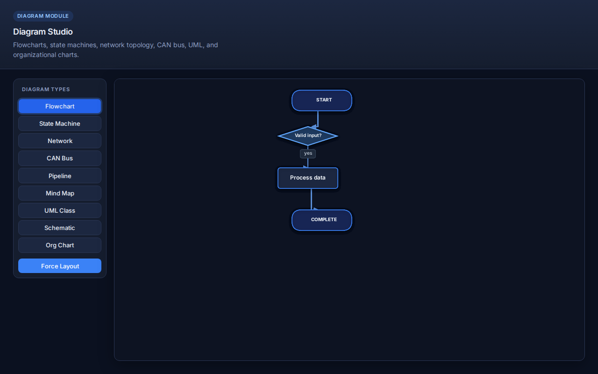

<p align="center">
  
</p>

<h1 align="center">LightDraw.js</h1>

<p align="center">
  <strong>Ultra-lightweight, production-ready 2D graphics and UI engine for the web.</strong><br/>
  Build dashboards, automotive instrument clusters, diagrams, and interactive UIs — with zero dependencies.
</p>

<p align="center">
  <a href="https://github.com/rakeshrajena/lightDraw">GitHub</a>
  ·
  <a href="./docs/getting-started.md">Documentation</a>
  ·
  <a href="./docs/README.md">Docs index</a>
  ·
  <a href="https://www.npmjs.com/package/lightdraw">npm</a>
</p>

<p align="center">
  
  
  
  
</p>

---

## What is LightDraw?

**LightDraw** is a retained-mode 2D scene graph for browsers and embedded WebViews. It ships as small, tree-shakeable bundles and targets use cases where you need **real graphics performance** without pulling in React, D3, or a charting framework.

Use it when you want to:

- Render **live dashboards** (gauges, charts, clocks) on canvas or HTML
- Build **automotive digital cockpits** with tachometers, TPMS, ADAS status, and themes
- Draw **flowcharts, org charts, UML, and network diagrams** with smart connector routing
- Ship **accessible UI components** (buttons, forms, tables, dialogs) via the HTML renderer
- Load scenes from **JSON** — ideal for AI-generated UIs and low-code tools
- Support **legacy ES5 browsers** in automotive and industrial embedded targets

**Repository:** [github.com/rakeshrajena/lightDraw](https://github.com/rakeshrajena/lightDraw)

## Screenshots

Full demo pages at 1280×800 — header, controls, and canvas included (not cropped).

### Dashboard widgets

Live gauges, line charts, progress bars, and status cards — interactive hover tooltips included.

<p align="center">
  
</p>

### Automotive instrument cluster

Full digital cockpit with speedometer, tachometer, fuel, TPMS (FL/FR/RL/RR), and warning lamps.

<p align="center">
  
</p>

### Diagram module

Flowcharts, state machines, class diagrams, mind maps, and network topology with routed connectors.

<p align="center">
  
</p>

### UI component library

17 built-in components with professional CSS theming — buttons, forms, tabs, tables, dialogs, and more.

<p align="center">
  
</p>

### Animation engine

Timelines, easing, motion paths, and stagger — no GSAP or third-party animation library required.

<p align="center">
  
</p>

> Regenerate screenshots after UI changes: `npm run screenshots:readme`

## Features

- **Zero dependencies** — no React, jQuery, GSAP, or other libraries required
- **Multiple renderers** — Canvas, SVG, and HTML/CSS with automatic detection
- **Retained-mode scene graph** — unlimited nesting, transforms, clipping, shadows
- **Animation engine** — timelines, easing, chaining (no third-party libs)
- **Event system** — pointer, touch, drag, keyboard with optimized hit testing
- **Camera** — pan, zoom, rotate, follow object, coordinate conversion
- **Layout engine** — grid, stack, flex, flow, tree, circular layouts
- **UI components** — button, card, slider, progress bar, toggle, and more
- **Dashboard widgets** — charts, gauges, speedometer, clock, battery
- **Automotive module** — instrument cluster, tachometer, ADAS, warning lamps
- **Diagram module** — flowcharts, org charts, connector routing
- **AI-friendly JSON** — load and export scenes as JSON definitions
- **Plugin system** — extend with custom components, renderers, themes
- **Legacy browser support** — ES5 build for embedded/automotive browsers

## Quick Start

### CDN

```html
<div id="app"></div>
<script src="https://cdn.jsdelivr.net/npm/lightdraw/dist/lightdraw.min.js"></script>
<script>
  const app = LightDraw.createApp('#app', { width: 800, height: 600 });

  const circle = app.circle({ x: 200, y: 200, radius: 60, fill: '#2563eb' });
  app.add(circle);

  circle.animate({ x: 500, rotation: 360, duration: 1200, easing: 'easeOutBounce' });
</script>
```

### npm

```bash
npm install lightdraw
```

```javascript
import LightDraw from 'lightdraw';

const app = LightDraw.createApp('#app');
const rect = app.rect({ width: 100, height: 50, fill: '#ef4444' });
app.add(rect);
```

### Modular imports (v0.4+)

Load only what you need — smaller bundles and faster startup:

```javascript
import LightDraw from 'lightdraw/core';
import svgPlugin from 'lightdraw/svg';
import htmlPlugin from 'lightdraw/html';
import uiPlugin from 'lightdraw/ui';

LightDraw.use(svgPlugin);
LightDraw.use(htmlPlugin);
LightDraw.use(uiPlugin);

const app = LightDraw.createApp('#app', { renderer: 'html' });
```

| Subpath | Bundle | Contents |
|---------|--------|----------|
| `lightdraw/core` | `lightdraw.core.min.js` | App, shapes, canvas, animation, events |
| `lightdraw/svg` | `lightdraw.svg.min.js` | SVG renderer plugin |
| `lightdraw/html` | `lightdraw.html.min.js` | HTML renderer plugin |
| `lightdraw/ui` | `lightdraw.ui.min.js` | UI components |
| `lightdraw/dashboard` | `lightdraw.dashboard.min.js` | Dashboard widgets |
| `lightdraw/automotive` | `lightdraw.automotive.min.js` | Automotive widgets |
| `lightdraw/diagram` | `lightdraw.diagram.min.js` | Diagram module |
| `lightdraw` | `lightdraw.min.js` | Full bundle (all modules, backward compatible) |

Each bundle also ships an ES5 `.legacy.js` variant for embedded browsers.

```html
<!-- Core + HTML plugin via CDN -->
<script src="https://cdn.jsdelivr.net/npm/lightdraw/dist/lightdraw.core.min.js"></script>
<script src="https://cdn.jsdelivr.net/npm/lightdraw/dist/lightdraw.html.min.js"></script>
<script>
  LightDraw.use(LightDrawHtml.default);
  const app = LightDraw.createApp('#app', { renderer: 'html' });
</script>
```

## AI & LLM Integration

LightDraw is **JSON-first**: an LLM outputs a scene tree, you validate it, call `app.loadJSON()`, and get a live dashboard, form, diagram, or HMI — no React/Vue code generation required.

```
User prompt  →  LLM (with schema docs)  →  scene JSON  →  validateSceneJSON  →  app.loadJSON()  →  canvas / HTML UI
```

### Drop-in host page

Give agents a minimal HTML shell; they only need to produce the JSON payload:

```html
<link rel="stylesheet" href="https://cdn.jsdelivr.net/npm/lightdraw/dist/lightdraw.min.css">
<div id="app"></div>
<script src="https://cdn.jsdelivr.net/npm/lightdraw/dist/lightdraw.min.js"></script>
<script>
  const app = LightDraw.createApp('#app', {
    width: 960,
    height: 540,
    renderer: 'html',
    background: '#0d1322',
  });

  // Replace with LLM-generated scene (or fetch from your API)
  const scene = {
    type: 'group',
    children: [
      { type: 'card', props: { title: 'Server health', x: 16, y: 16, width: 420, height: 200 } },
      { type: 'lineChart', props: { data: [22, 35, 28, 48, 41, 55], x: 32, y: 56, width: 380, height: 140 } },
      { type: 'gauge', props: { value: 68, size: 120, x: 480, y: 40 } },
      { type: 'button', props: { label: 'Acknowledge', variant: 'primary', x: 480, y: 200 } },
    ],
  };

  const result = LightDraw.validateSceneJSON(scene);
  if (!result.valid) {
    console.error(result.errors);
  } else {
    app.loadJSON(scene);
    app.setUiTheme({ preset: 'dark' });
  }
</script>
```

### Example scenes by domain

**Dashboard** — gauges, charts, clocks ([schema](./docs/dashboard-widgets-schema.md)):

```javascript
app.loadJSON({
  type: 'group',
  children: [
    { type: 'speedometer', props: { value: 95, size: 160, x: 40, y: 40 } },
    { type: 'lineChart', props: { data: [20, 45, 30, 60, 55, 80], width: 320, height: 140, x: 240, y: 50 } },
    { type: 'battery', props: { value: 82, x: 600, y: 80 } },
  ],
});
```

**UI form** — buttons, inputs, toggles ([schema](./docs/ui-components-schema.md)):

```javascript
app.loadJSON({
  type: 'group',
  children: [
    { type: 'input', props: { label: 'Email', placeholder: 'you@example.com', fullWidth: true, x: 24, y: 24, width: 320 } },
    { type: 'checkbox', props: { label: 'Subscribe to updates', checked: true, x: 24, y: 88 } },
    { type: 'button', props: { label: 'Submit', variant: 'primary', x: 24, y: 132 } },
  ],
});
```

**Diagram** — flowcharts, state machines, networks ([schema](./docs/diagram-module-schema.md)):

```javascript
app.loadJSON({
  type: 'flowchart',
  props: {
    data: {
      nodes: [
        { id: 'start', label: 'Start', type: 'start' },
        { id: 'check', label: 'Valid?', type: 'decision' },
        { id: 'end', label: 'Done', type: 'end' },
      ],
      edges: [
        { from: 'start', to: 'check' },
        { from: 'check', to: 'end', label: 'yes' },
      ],
    },
  },
});
```

### Prompt the model

Attach the relevant schema doc to context, then use a system rule like:

```
You generate LightDraw scene JSON only.
- Root: { "type": "group", "children": [...] } unless a single diagram widget is requested.
- Each child: { "type": "<widget>", "props": { "x", "y", ... } }
- Use only types from the provided schema catalog.
- Colors as #rrggbb hex. No JavaScript. No markdown fences in the JSON output.
```

Validate, render, and round-trip:

```javascript
const json = app.exportJSON();
app.clear();
app.loadJSON(json);
LightDraw.scenesEqual(json, app.exportJSON()); // stable widgets round-trip
```

Export for review or sharing: `app.export({ format: 'html' })` or `app.export({ format: 'json', validate: true })`.

### Schema catalogs (give these to your LLM)

| Domain | Types | Schema |
|--------|-------|--------|
| UI | 17 components (button, slider, dialog, table, …) | [ui-components-schema.md](./docs/ui-components-schema.md) |
| Dashboard | Gauges, charts, clock, thermometer, … | [dashboard-widgets-schema.md](./docs/dashboard-widgets-schema.md) |
| Automotive | Cluster, TPMS, CAN, ADAS, … | [automotive-widgets-schema.md](./docs/automotive-widgets-schema.md) |
| Diagram | Flowchart, state machine, UML, network, … | [diagram-module-schema.md](./docs/diagram-module-schema.md) |

Full guide: **[docs/ai-integration-guide.md](./docs/ai-integration-guide.md)** — prompt templates, validation, export pipeline.

### Try it live

| Demo | What to explore |
|------|-----------------|
| [examples/demo-dashboard.html](./examples/demo-dashboard.html) | Live widgets + 82 chart types |
| [examples/demo-ui.html](./examples/demo-ui.html) | All 17 UI components + themes |
| [examples/demo-ui-catalog.html](./examples/demo-ui-catalog.html) | Variant gallery for prompting |
| [examples/demo-diagram.html](./examples/demo-diagram.html) | 9 diagram types |
| [examples/demo-automotive.html](./examples/demo-automotive.html) | Instrument cluster + widgets |
| Playground `npm run dev:website` | All demos embedded at http://localhost:5173 |

```bash
npm run build && npm run dev:website   # local playground
```

## Build Outputs

| File | Description |
|------|-------------|
| `dist/lightdraw.core.min.js` | Core only (canvas, shapes, animation) |
| `dist/lightdraw.svg.min.js` | SVG renderer plugin |
| `dist/lightdraw.html.min.js` | HTML renderer plugin |
| `dist/lightdraw.ui.min.js` | UI components plugin |
| `dist/lightdraw.dashboard.min.js` | Dashboard widgets plugin |
| `dist/lightdraw.automotive.min.js` | Automotive widgets plugin |
| `dist/lightdraw.diagram.min.js` | Diagram module plugin |
| `dist/lightdraw.esm.js` | Full ES Module build |
| `dist/lightdraw.js` | Full UMD / IIFE (development) |
| `dist/lightdraw.min.js` | Full UMD minified (CDN) |
| `dist/*.legacy.js` | ES5 variants for each bundle |
| `dist/index.d.ts` | TypeScript declarations (full) |
| `dist/lightdraw.min.css` | HTML renderer styles |

## Documentation & Playground

| Resource | Path |
|----------|------|
| **Docs index** | [docs/README.md](./docs/README.md) |
| Getting started | [docs/getting-started.md](./docs/getting-started.md) |
| **AI integration** | [docs/ai-integration-guide.md](./docs/ai-integration-guide.md) |
| UI theme / responsive / legacy UI | [docs/ui-theme-guide.md](./docs/ui-theme-guide.md) · [responsive](./docs/responsive-guide.md) · [legacy UI](./docs/legacy-ui-guide.md) |
| Animation / Plugins / Performance | [docs/](./docs/) |
| API reference | `npm run docs:api` → `docs/api/` |
| Playground | `npm run dev:website` → http://localhost:5173 |
| Examples | [examples/](./examples/) |

```bash
npm run docs:api        # TypeDoc API reference
npm run dev:website     # Vite playground (build library first)
npm run build:website   # Static site → website/dist/
npm run screenshots:readme  # Refresh README demo images
npm run ci:local        # Full local test + benchmark suite
```

## Development

See [IMPLEMENTATION_PLAN.md](./IMPLEMENTATION_PLAN.md) for the phased roadmap (quality, tests, performance, memory gates per phase).
See [PROJECT_STATUS.md](./PROJECT_STATUS.md) for current feature status.

```bash
npm install
npm run build
npm test
npm run ci:local      # coverage, perf, phase tests, benchmarks
```

## Browser Support

Chromium 49+, Chrome, Firefox, Edge, Safari, Android WebView, embedded Chromium, automotive infotainment browsers.

Use `lightdraw.legacy.js` for ES5 environments.

## License

MIT — see [LICENSE](./LICENSE).

---

## Author

**Rakesh Ranjan Jena**

- Website: [rakeshranjanjena.com](https://rakeshranjanjena.com)
- Blog: [rrjprince.com](https://www.rrjprince.com/)
- LinkedIn: [linkedin.com/in/rrjprince](https://www.linkedin.com/in/rrjprince/)
- GitHub: [github.com/rakeshrajena/lightDraw](https://github.com/rakeshrajena/lightDraw)

Made with ❤️ for the web developer & AI community.
